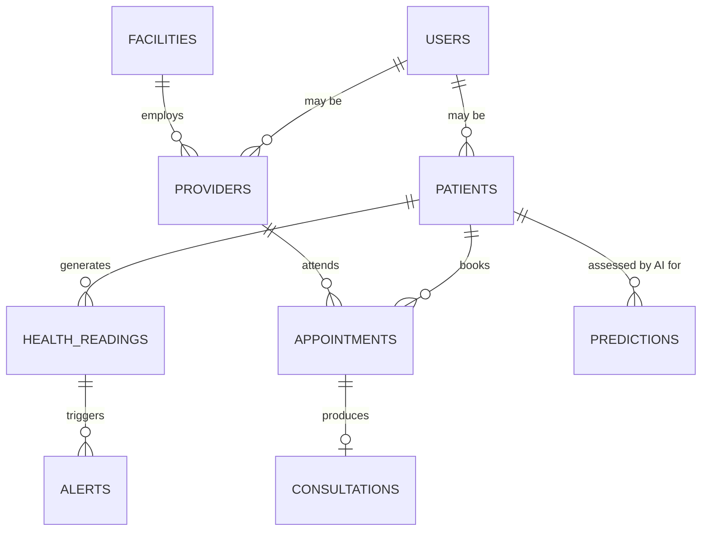

# Backend / Database Schema

**Related:** `architecture.md`, `api-spec.md`
**Database:** PostgreSQL · **Status:** Design-time schema; DDL/migrations to be produced during implementation.

## 1. Entity-Relationship Overview

## 2. Entities

**users** — authentication & role identity (`patient`, `doctor`, `administrator`, `executive`). Key fields: id, email, password_hash, role, created_at.

**patients** — patient profile (may link to a `users` record). Key fields: id, user_id (nullable), full_name, date_of_birth, gender, contact_info, registered_at, assigned_provider_id (nullable FK → providers.id — ADR-018).

**providers** — physicians. Key fields: id, user_id, full_name, specialty, facility_id, license_ref (simulated), created_at.

**facilities** — healthcare facilities. Key fields: id, name, type, location.

**appointments** — scheduled telemedicine sessions. Key fields: id, patient_id, provider_id, scheduled_at, status (`scheduled`/`in_progress`/`completed`/`cancelled`), created_at.

**consultations** — record of a completed appointment. Key fields: id, appointment_id, summary, recommendations, created_at.

**health_readings** — simulated vitals from remote monitoring. Key fields: id, patient_id, heart_rate, systolic_bp, diastolic_bp (ADR-016 — split from a single `blood_pressure` field), spo2, temperature, glucose, recorded_at.

**alerts** — abnormal-reading notifications. Key fields: id, patient_id, reading_id, severity, status (`open`/`acknowledged`/`resolved`), created_at.

**predictions** — AI risk assessment output. Key fields: id, patient_id, risk_category, confidence_score, model_version, recommendation, created_at.

## 3. Relationships Summary

- A patient has many appointments, health readings, and predictions.
- A provider has many appointments and belongs to one facility.
- An appointment produces at most one consultation record.
- A health reading may trigger zero or more alerts (abnormal thresholds).
- Every prediction is tied to exactly one patient and records the model version used, supporting the "prediction history" and "AI evaluation report" deliverables.

## 4. Indexing & Performance Notes

- Foreign keys (`patient_id`, `provider_id`, `appointment_id`, `reading_id`) indexed for join performance.
- `health_readings.recorded_at` and `predictions.created_at` indexed to support time-series queries (trends, dashboards).
- Dashboard aggregate queries are candidates for Redis caching rather than repeated heavy `GROUP BY` queries against PostgreSQL.

## 5. Migration Strategy (planned)

Alembic (confirmed, `deccission.md` ADR-013) versions schema changes; no manual/ad-hoc schema edits against a running environment. Every schema change is expected to be paired with an ADR entry in `deccission.md` if it reflects a design decision (not just a fix).

## 6. Implementation status (Phase 1)

All 9 entities above are implemented as SQLAlchemy 2.0 models under `backend/app/models/`, with an
initial Alembic migration at `backend/alembic/versions/`. Verified: `alembic upgrade head` /
`downgrade base` against SQLite (no PostgreSQL available in the authoring sandbox — needs a real
run via `docker compose up`, see `infra/`).

**Synthea mapping** (`backend/scripts/fetch_synthea.py`, `backend/scripts/seed_synthea.py`):

| Schema table | Synthea CSV source |
|---|---|
| `facilities` | `organizations.csv` (only orgs referenced by seeded providers) |
| `providers` | `providers.csv` (+ a placeholder `users` row per provider — real auth in Phase 2) |
| `patients` | `patients.csv` (living patients only; `user_id` left `NULL` — no patient login yet) |
| `health_readings` | `observations.csv`, grouped by (patient, encounter); `heart_rate`/`systolic_bp`/`diastolic_bp`/`glucose` are real Synthea LOINC-coded values (8867-4, 8480-6, 8462-4, 2339-0); `spo2`/`temperature` are simulated within a normal physiological range where the encounter doesn't carry them (LOINC 2708-6/8310-5 appear in only ~5% of encounters) — see ADR-017 |

Verified end-to-end against SQLite: 200 sampled patients → 50 facilities, 50 providers, 953
`health_readings` rows, with plausible vitals ranges (HR 60–100+, systolic 99–197 reflecting real
hypertensive cases in the sample, temperature/SpO2 within simulated normal bounds).
