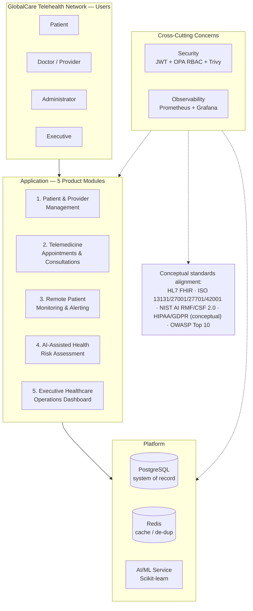

# 1. Enterprise Digital Healthcare Architecture Diagram

**Source:** `docs/PRD.md` §1–2 (GlobalCare Telehealth Network context, 8M+ simulated patients), `docs/architecture.md` §1.

The big-picture view: GlobalCare's four user personas, the five product modules they use, the platform layer underneath, and the cross-cutting concerns (security, observability) and standards this project conceptually aligns with — not a network or deployment diagram, those are separate (§8, §9).

