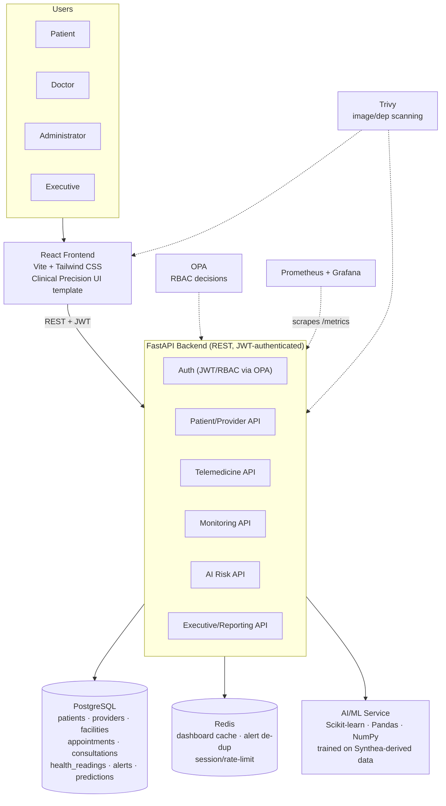

# 2. High-Level Solution Architecture Diagram

**Source:** `docs/architecture.md` §2, refined against the real implementation (Phases 2–7).

```mermaid
flowchart TB
    subgraph USERS["Users"]
        PAT["Patient"]
        DOC["Doctor"]
        ADM["Administrator"]
        EXE["Executive"]
    end

    FE["React Frontend<br/>Vite + Tailwind CSS<br/>Clinical Precision UI template"]

    subgraph API["FastAPI Backend (REST, JWT-authenticated)"]
        AUTH["Auth (JWT/RBAC via OPA)"]
        A1["Patient/Provider API"]
        A2["Telemedicine API"]
        A3["Monitoring API"]
        A4["AI Risk API"]
        A5["Executive/Reporting API"]
    end

    PG[("PostgreSQL<br/>patients · providers · facilities<br/>appointments · consultations<br/>health_readings · alerts · predictions")]
    REDIS[("Redis<br/>dashboard cache · alert de-dup<br/>session/rate-limit")]
    AIML["AI/ML Service<br/>Scikit-learn · Pandas · NumPy<br/>trained on Synthea-derived data"]

    USERS --> FE
    FE -->|"REST + JWT"| API
    API --> PG
    API --> REDIS
    API --> AIML

    OPA["OPA<br/>RBAC decisions"] -.-> API
    METRICS["Prometheus + Grafana"] -.->|"scrapes /metrics"| API
    TRIVY["Trivy<br/>image/dep scanning"] -.-> API
    TRIVY -.-> FE
```
