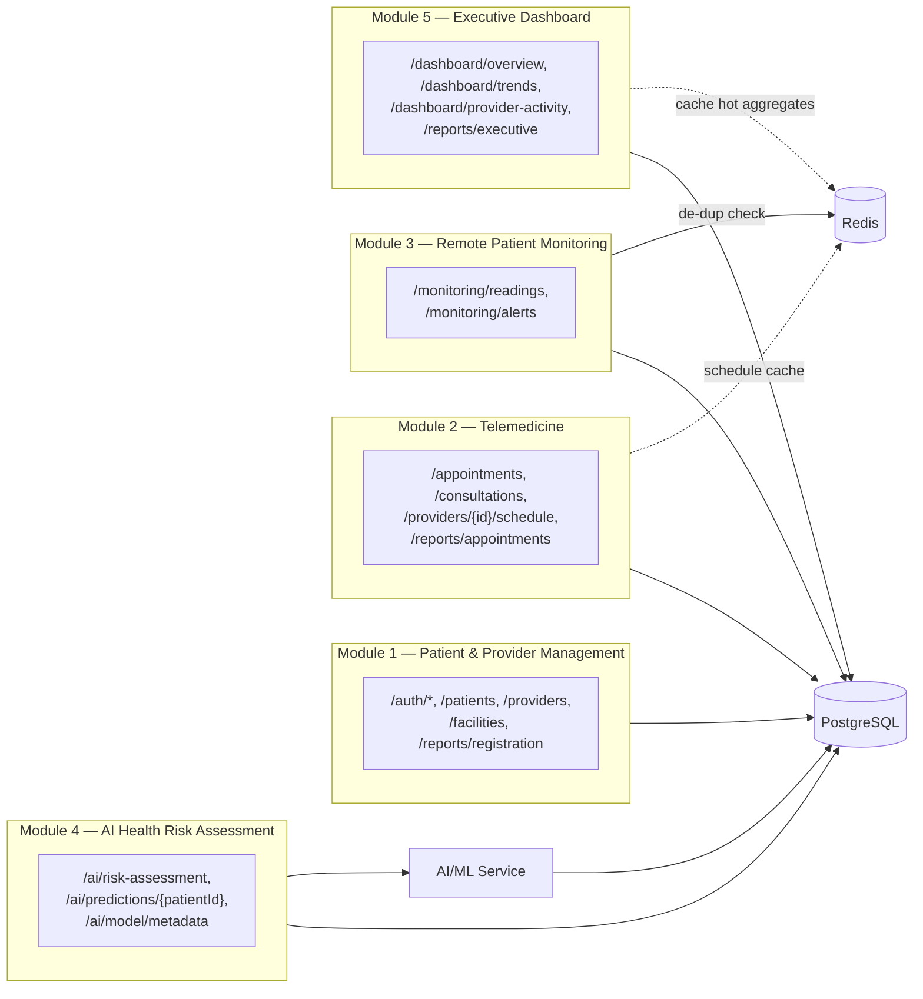

# 3. Detailed System Architecture Diagram

**Source:** `docs/architecture.md` §3 (Component Breakdown) and §4 (Module → Architecture Mapping), refined against the real implementation.

| Component | Responsibility |
|---|---|
| React frontend | All user-facing screens across the four personas; consumes REST APIs |
| FastAPI backend | Business logic, validation, auth issuance/verification, orchestration across DB/cache/AI service |
| PostgreSQL | Durable system of record for all clinical/operational entities |
| Redis | Ephemeral/fast-path data: KPI caching, alert de-duplication, session & rate-limit state |
| AI/ML service | Preprocessing, model training/inference for health risk classification |
| Prometheus + Grafana | Metrics collection and visualization |
| OPA | Policy-based authorization decisions (role-gated endpoints — `deccission.md` ADR-024) |
| Trivy | Vulnerability scanning of images/dependencies |
