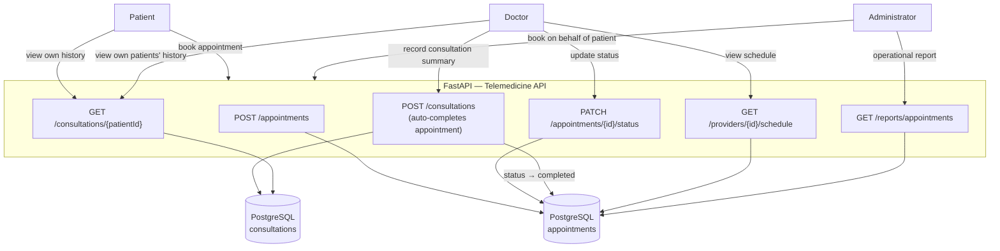

# 4. Telemedicine Platform Architecture Diagram

**Source:** `docs/flow.md` §2 (Telemedicine Appointment & Consultation Flow).

Role scoping: a doctor only sees/acts on their own appointments and schedule; consultation history is additionally restricted to the doctor's own appointments with that patient — an extension of the assigned-patient rule (`Security.md` §3) to the appointment relationship.
