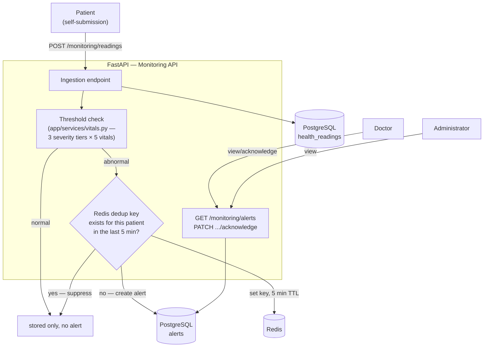

# 5. Remote Patient Monitoring Architecture Diagram

**Source:** `docs/flow.md` §3 (Remote Monitoring & Alert Flow), `app/services/vitals.py`, `app/core/redis_client.py`.

Exit criteria (Phase 4): a simulated abnormal reading correctly produces exactly one alert — verified against real Redis, not just the test fake (`docs/test-execution-log.md` Phase 4).
