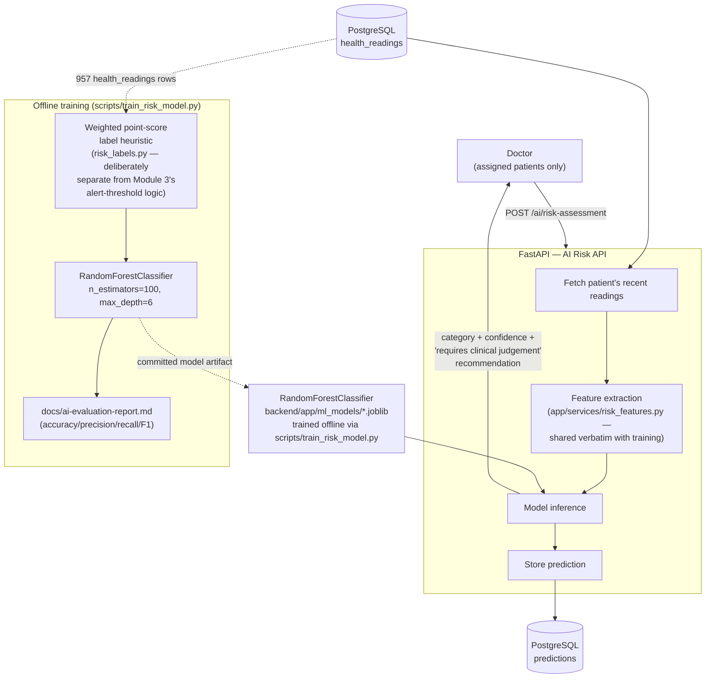

# 6. AI Health Risk Assessment Architecture Diagram

**Source:** `docs/flow.md` §4 (AI Risk Prediction Flow), `app/services/risk_features.py`, `scripts/train_risk_model.py`.

`GET /ai/model/metadata` (Administrator-only) exposes the training metrics shown above. Every prediction response is explicitly framed as decision-support (`docs/PRD.md` §7) — never a diagnosis.
