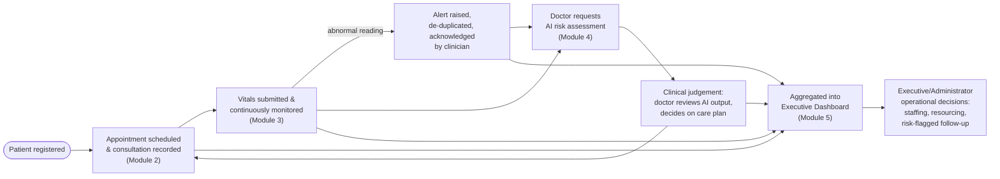

# 7. Clinical Workflow Architecture Diagram

**Source:** `docs/flow.md` (all sections) — the clinical journey across all five modules at an architecture level, distinct from the detailed end-to-end sequence diagram (§17).

Continuity of care is the design goal this diagram illustrates: a patient's record stays consistent across scheduling, monitoring, and AI assessment rather than fragmenting across separate systems (`docs/flow.md` §1), and every clinical/operational signal ultimately surfaces on the dashboard that executives and administrators use to act on it.
