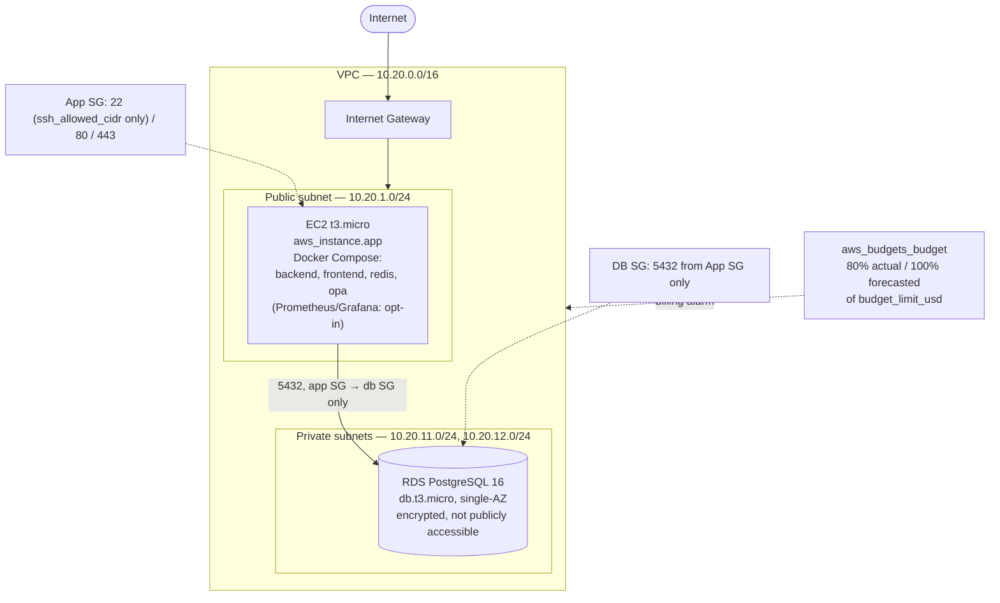

# 8. Enterprise Network Architecture Diagram

**Source:** `docs/architecture.md` §5, `docs/TRD.md` §8 — now grounded in the real Terraform resources authored (not yet applied — `deccission.md` ADR-027) in `infra/terraform/`.

Not yet provisioned (noted as optional in `architecture.md` §5): CloudFront/Route53 in front of the app, and a TLS-terminating reverse proxy — `infra/terraform/README.md` documents both as manual "day 2" steps this module deliberately doesn't automate.
