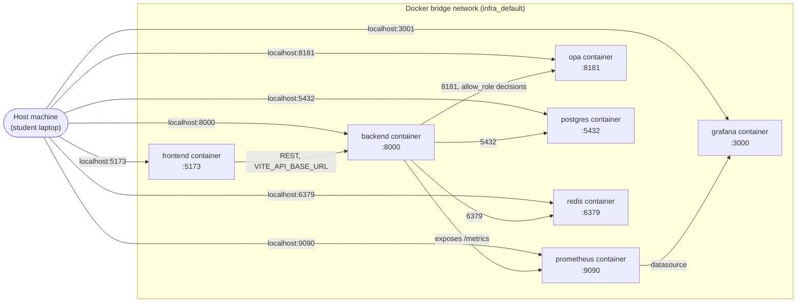
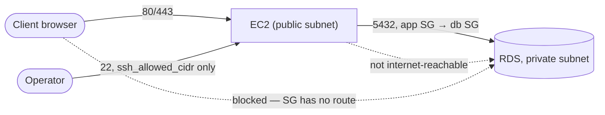

# 9. Network Flow Diagram

**Source:** `infra/docker-compose.yml` (mandatory local profile — real, running), `infra/terraform/` (stretch AWS profile — written, not deployed).

## Local Docker Compose profile (the actual, current deployment)

## AWS profile (written, not deployed — `deccission.md` ADR-027)

