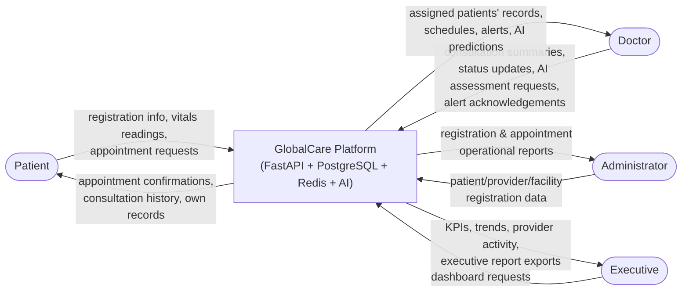

# 10. Data Flow Diagram (Level 0 — Context)

**Source:** `docs/api-spec.md` (role tables), `docs/backend-schema.md`.

The whole platform as a single process, with the four external entities and the data crossing the boundary in each direction.

