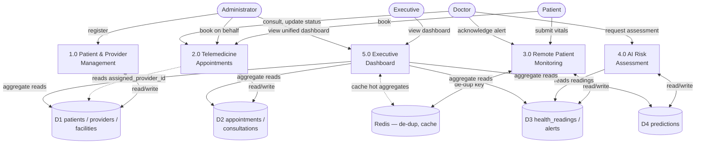

# 11. Data Flow Diagram (Level 1)

**Source:** Decomposition of §10 into the five module processes and their data stores (`docs/backend-schema.md`).

```mermaid
flowchart TB
    PAT(["Patient"])
    DOC(["Doctor"])
    ADM(["Administrator"])
    EXE(["Executive"])

    P1["1.0 Patient & Provider<br/>Management"]
    P2["2.0 Telemedicine<br/>Appointments"]
    P3["3.0 Remote Patient<br/>Monitoring"]
    P4["4.0 AI Risk<br/>Assessment"]
    P5["5.0 Executive<br/>Dashboard"]

    D1[("D1 patients / providers /<br/>facilities")]
    D2[("D2 appointments /<br/>consultations")]
    D3[("D3 health_readings /<br/>alerts")]
    D4[("D4 predictions")]
    DR[("Redis — de-dup, cache")]

    ADM -->|"register"| P1
    P1 <-->|"read/write"| D1

    PAT -->|"book"| P2
    ADM -->|"book on behalf"| P2
    DOC -->|"consult, update status"| P2
    P2 <-->|"read/write"| D2
    P2 -.->|"reads assigned_provider_id"| D1

    PAT -->|"submit vitals"| P3
    P3 <-->|"read/write"| D3
    P3 <-->|"de-dup key"| DR
    DOC -->|"acknowledge alert"| P3

    DOC -->|"request assessment"| P4
    P4 -->|"reads readings"| D3
    P4 <-->|"read/write"| D4

    EXE -->|"view dashboard"| P5
    ADM -->|"view unified dashboard"| P5
    P5 -->|"aggregate reads"| D1
    P5 -->|"aggregate reads"| D2
    P5 -->|"aggregate reads"| D3
    P5 -->|"aggregate reads"| D4
    P5 <-.->|"cache hot aggregates"| DR
```
