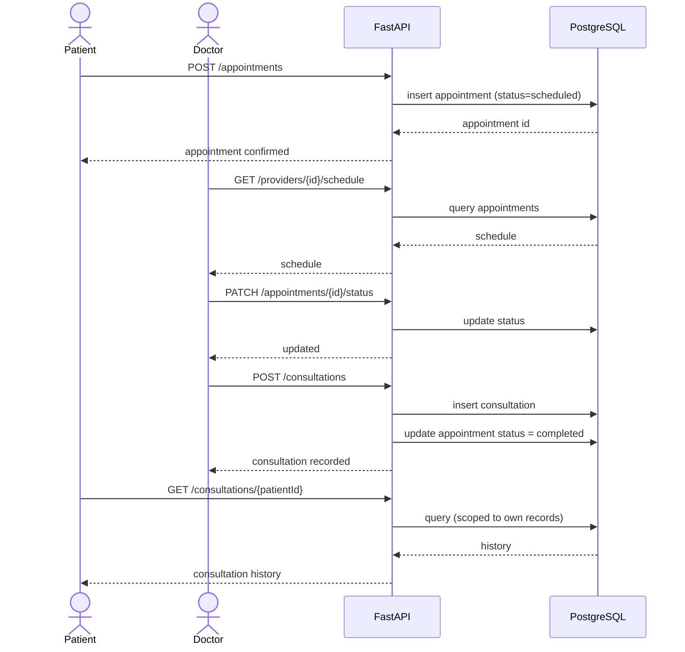

# 12. Telemedicine Workflow Diagram

**Source:** `docs/flow.md` §2, `backend/tests/test_appointments.py` (verified real sequence).

```mermaid
sequenceDiagram
    actor Patient
    actor Doctor
    participant API as FastAPI
    participant DB as PostgreSQL

    Patient->>API: POST /appointments
    API->>DB: insert appointment (status=scheduled)
    DB-->>API: appointment id
    API-->>Patient: appointment confirmed

    Doctor->>API: GET /providers/{id}/schedule
    API->>DB: query appointments
    DB-->>API: schedule
    API-->>Doctor: schedule

    Doctor->>API: PATCH /appointments/{id}/status
    API->>DB: update status
    API-->>Doctor: updated

    Doctor->>API: POST /consultations
    API->>DB: insert consultation
    API->>DB: update appointment status = completed
    API-->>Doctor: consultation recorded

    Patient->>API: GET /consultations/{patientId}
    API->>DB: query (scoped to own records)
    DB-->>API: history
    API-->>Patient: consultation history
```
