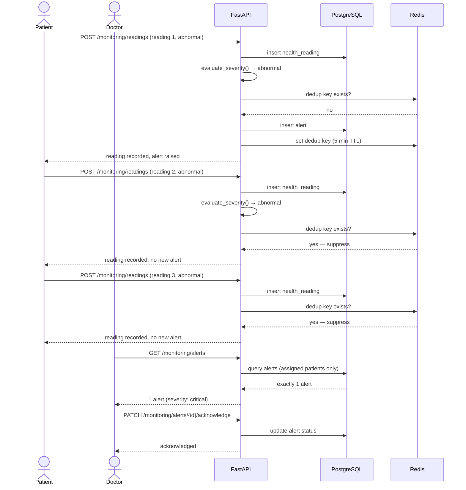

# 13. Remote Monitoring Workflow Diagram

**Source:** `docs/flow.md` §3, `backend/tests/test_monitoring.py::test_abnormal_reading_produces_exactly_one_alert_deduped` (the literal Phase 4 exit criteria, verified against real Redis).

