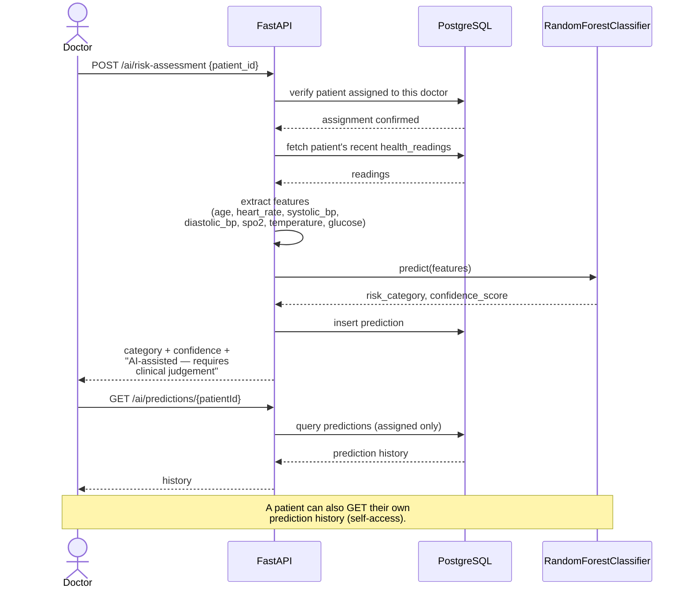

# 14. AI Prediction Workflow Diagram

**Source:** `docs/flow.md` §4, `backend/app/api/v1/ai.py`.

```mermaid
sequenceDiagram
    actor Doctor
    participant API as FastAPI
    participant DB as PostgreSQL
    participant Model as RandomForestClassifier

    Doctor->>API: POST /ai/risk-assessment {patient_id}
    API->>DB: verify patient assigned to this doctor
    DB-->>API: assignment confirmed
    API->>DB: fetch patient's recent health_readings
    DB-->>API: readings
    API->>API: extract features<br/>(age, heart_rate, systolic_bp,<br/>diastolic_bp, spo2, temperature, glucose)
    API->>Model: predict(features)
    Model-->>API: risk_category, confidence_score
    API->>DB: insert prediction
    API-->>Doctor: category + confidence +<br/>"AI-assisted — requires<br/>clinical judgement"

    Doctor->>API: GET /ai/predictions/{patientId}
    API->>DB: query predictions (assigned only)
    DB-->>API: prediction history
    API-->>Doctor: history

    Note over Doctor,Model: A patient can also GET their own<br/>prediction history (self-access).
```
