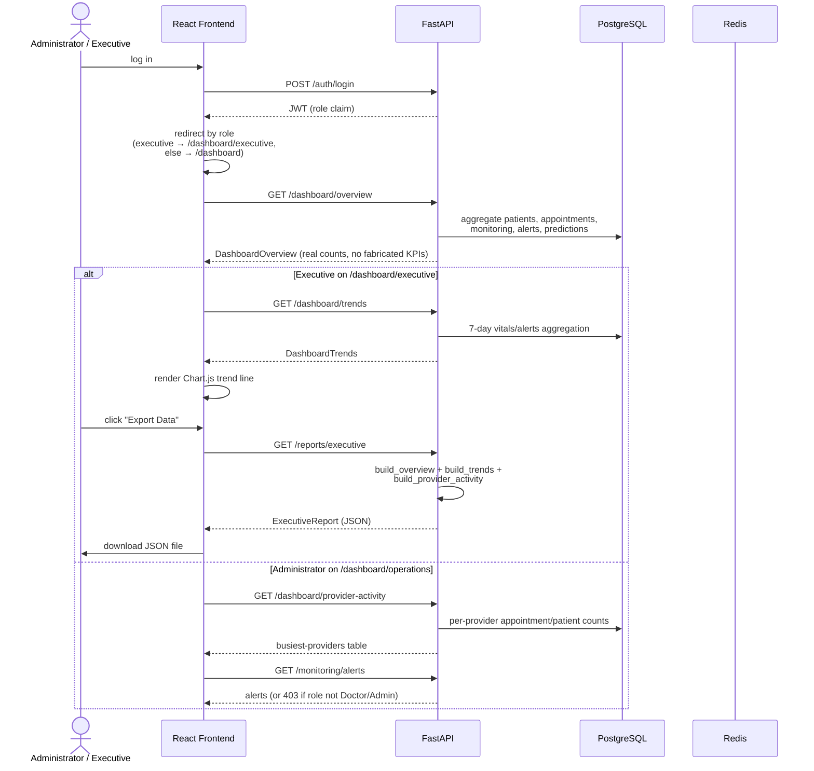

# 15. Healthcare Operations Workflow Diagram

**Source:** `docs/flow.md` §5, `docs/UIUX.md` §3 (3-view dashboard), `backend/app/api/v1/dashboard.py` — reflects the real Phase 6 implementation.

Wherever the supplied template assumed untracked data (bed occupancy, no-show rate, provider presence), the real implementation substitutes a computable equivalent instead of fabricating a number — `deccission.md` ADR-022.
