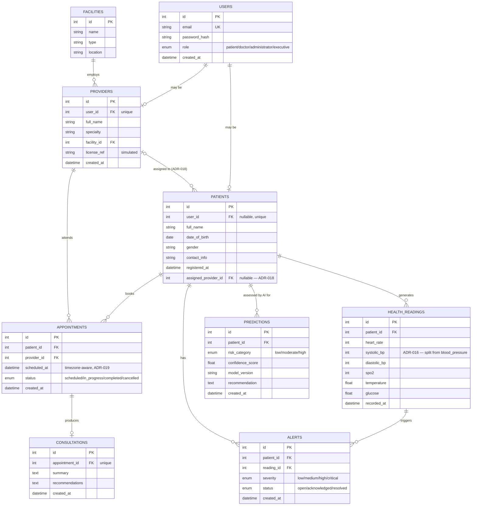

# 16. Database Entity Relationship Diagram

**Source:** `docs/backend-schema.md` §1–2 (canonical design-level source) and `backend/app/models/*.py` (real SQLAlchemy models, Phase 1). This file adds attribute-level detail matching the actual implementation, not just the design-level entity list.

All timestamp columns use `DateTime(timezone=True)` (ADR-019). Full field-by-field rationale: `docs/backend-schema.md` §2.
