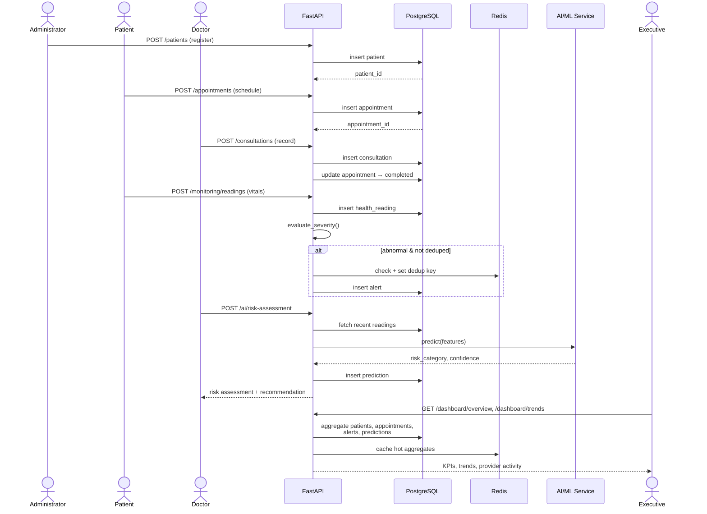

# 17. Sequence Diagram — Registration → Appointment → Monitoring → AI Assessment → Executive Reporting

**Source:** `docs/flow.md` §6 (mandatory end-to-end sequence, exam brief §8.17) — converted from ASCII to real Mermaid, spanning all five modules.

